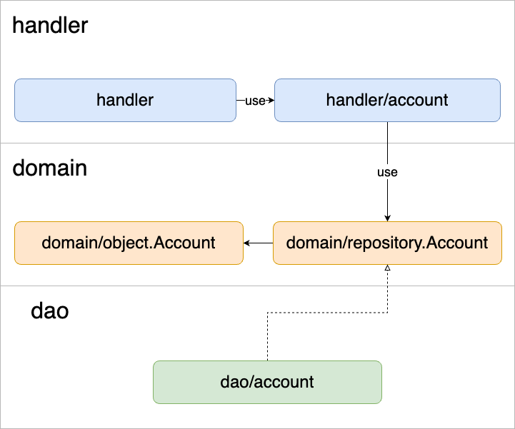

# yatter-backend-go

## Table of Contents
* [Project Overview](#project-overview)
    * [Introduction](#introduction)
    * [API overview](#api-overview)
* [Developed Features](#developed-features)
    * [Account](#account)
        * [POST /accouts](#post-accounts)
        * [POST /accounts/update_credentials](#update_credentials)
        * [GET /accounts/{username}](#get_accounts)
        * [POST /accounts/{username}/follow](#follow)
        * [GET /accounts/{username}/following](#following)
        * [GET /accounts/{username}/followers](#followers)
        * [POST /accounts/{username}/unfollow](#unfollow)
        * [GET /accounts/relationships](#relationships)
    * [Status](#status)
        * [POST /statuses](#post_statuse)
        * [GET /statuses/{id}](#get_statuses)
        * [DELETE /statuses/{id}](#delete_statuses) 
    * [Timeline](#timeline)
        * [GET /timelines/home](#home_timelines)
        * [GET /timelines/public](#public_timelines)
* [Development Environment](#development-environment)
    * [Requirements](#requirements)
	* [Start](#start)
	* [Shutdown](#shutdown)
	* [Log](#log)
	* [Hot Reload](#hot-reload)
	* [Swagger UI](#swagger-ui)
	* [DB](#db)
* [Code](#code)
    * [Architecture](#architecture)
    * [Module Dependency](#module-dependency)
    * [Library](#library)
    * [Utilities](#utilities)

## Project Overview

### Introduction

2023-DMM-Go-internで作成したWeb API. <br> 3日間で各種エンドポイントの実装を行った.

### API overview

Yatter(like Twitter)のWeb APIを実装する. <br> ユーザーのアカウント作成・取得・変更やユーザーが新たな投稿（status）を出来るようにエンドポイントを実装する.

## Developed Features

以下のエンドポイントを実装.

### Account

#### POST /accouts
新たなユーザーアカウントを作成するエンドポイント.
```
// request body
{
  "username": "john",
  "password": "P@ssw0rd"
}
```
```
// response body
{
  "id": 6,
  "username": "john",
  "create_at": "0001-01-01T00:00:00Z",
  "followers_count": 0,
  "following_count": 0
}
```

#### POST /accounts/update_credentials
ユーザー情報を変更・追加するエンドポイント.<br> mulitipart/form-dataでアバターやヘッダー画像を送信可能.
```
//response body
{
  "id": 0,
  "username": "john",
  "display_name": "ジョン",
  "create_at": "2023-08-04T11:30:01.408Z",
  "followers_count": 52,
  "following_count": 128,
  "note": "string",
  "avatar": "string",
  "header": "string"
}
```
       
#### GET /accounts/{username}
usernameで指定されたアカウントを取得. レスポンスは上記と同様.

#### POST /accounts/{username}/follow
認証されたユーザーがusernameで指定されたアカウントをフォローするエンドポイント.
```
//response body
{
  "id": 6,
  "following": true,
  "followed_by": false
}
```

#### GET /accounts/{username}/following
usernameで指定されたユーザーがフォローしているアカウントを列挙.
```
//response body
[
  {
    "id": 1,
    "username": "yatter",
    "create_at": "2023-08-03T14:41:25+09:00",
    "followers_count": 2,
    "following_count": 0
  },
  {
    "id": 3,
    "username": "yatter1",
    "create_at": "2023-08-03T15:07:40+09:00",
    "followers_count": 1,
    "following_count": 1
  },
]
```

#### GET /accounts/{username}/followers
usernameで指定されたユーザーのフォロワーを取得.

#### POST /accounts/{username}/unfollow
usernameで指定されたユーザーのフォローを外すエンドポイント.

#### GET /accounts/relationships
認証されたユーザーとクエリで指定されたユーザー(複数可)との関係を返すエンドポイント.

### Status
#### POST /statuses
認証されたユーザーがstatusを投稿できるエンドポイント.
```
// requeest body
{
   "status": "content"
}
```
```
// response body
{
  "id": 17,
  "content": "content",
  "create_at": "0001-01-01T00:00:00Z",
  "account": {
    "id": 1,
    "username": "john",
    "create_at": "2023-08-04T16:51:37+09:00",
    "followers_count": 2,
    "following_count": 1
  }
}
```

#### GET /statuses/{id}
idで指定されたstatusの投稿の情報を返す.

#### DELETE /statuses/{id}
idで指定されたstatusを削除.

### Timeline

#### GET /timelines/home
認証されたユーザーがフォローしているユーザーのstatus投稿を一覧で取得. クエリパラメータでmax_id, since_id, limitを指定できる.

#### GET /timelines/public
status投稿の一覧を取得. クエリパラメータでmax_id, since_id, limitを指定できる.

## Development Environment
開発環境をdocker-composeで構築しています。

### Requirements
* Go
* docker / docker-compose

### Start
```
docker compose up -d
```

### Shutdown
```
docker compose down
```

### Log
```
# ログの確認
docker compose logs

# ストリーミング
docker compose logs -f

# webサーバonly
docker compose logs web
docker compose logs -f web
```

### Hot Reload
[air](https://github.com/cosmtrek/air)によるホットリロードをサポートしており、コードを編集・保存すると自動で反映されます。
読み込まれない場合は`docker compose restart`を実行してください。

### Swagger UI
API仕様をSwagger UIで確認できます。

開発環境を立ち上げ、Webブラウザで[localhost:8081](http://localhost:8081)にアクセスしてください。

#### Test
各API定義の"Try it out"からAPIの動作確認を行うことができます。

#### Authentication
鍵マークのついたエンドポイントは認証付きエンドポイントです。

`Authentication`というHTTPヘッダに`username ${ユーザー名}`を指定する単純な仕様です。

動作確認の際には画面上部の"Authorize"からヘッダの値の設定を行ってください。

### DB
マイグレーションツールの用意はありません。

初回起動時に`ddl/`以下にあるSQLファイルが実行されます。
再読み込みの際は`.data/mysql/`を削除し、DBを初期化してください。
```
docker compose down  # 開発環境が稼働中なら止める
rm -rfd .data/mysql  # `.data/mysql/`以下を削除
docker compose up -d # 再起動
```

## Code
### Architecture
```
.
├── app      ----> application core codes
│   ├── config   ----> config
│   ├── domain   ----> domain layer, core business logics
│   ├── handler  ----> (interface layer & application layer), request handlers
│   └── dao      ----> (infrastructure layer), implementation of domain/repository
│
└── ddl      ----> DB definition master
```

#### config
サーバーの設定をまとめたパッケージです。DBやlistenするポートなどの設定を取得するAPIがまとめてあります。

#### domain
アプリケーションのモデルを扱うdomain層のパッケージです。

##### domain/object
ドメインに登場するデータ・モノの表現やその振る舞いを記述するパッケージです。
今回は簡単のためDTOの役割も兼ねています。

##### domain/repository
domain/objectで扱うEntityの永続化に関する処理を抽象化し、インターフェースとして定義するパッケージです。
具体的な実装はdaoパッケージで行います。

#### handler
HTTPリクエストのハンドラを実装するパッケージです。
リクエストからパラメータを読み取り、エンドポイントに応じた処理を行ってレスポンスを返します。
機能の提供のために必要になる各種処理の実装は別のパッケージに切り分け、handlerは入出力に注力するケースも多いですが、今回は簡単のため統合しています。

#### dao
domain/repositoryに対する実装を提供するパッケージです。
DBなど外部モジュールへアクセスし、データの保存・取得・更新などの処理を実装します。

### Module Dependency


### Library
* HTTP
    * chi（[ドキュメント](https://pkg.go.dev/github.com/go-chi/chi/v5)）
* DB
    * sqlx（[ドキュメント](https://pkg.go.dev/github.com/jmoiron/sqlx)）

### Utilities
このテンプレートでは実装をサポートするユーティリティ関数を提供しています。

#### app/handler/auth
認証付きエンドポイントの実装のためのミドルウェア関数を提供しています。
`chi.Mux#Use`や`chi.Mux#With`を用いて利用できます。
- [chiドキュメント](https://pkg.go.dev/github.com/go-chi/chi/v5)

ミドルウェアを埋め込んだエンドポイントでは`*http.Request`から`AccountOf`でリクエストと紐づくアカウントを取得できます。
```
// var r *http.Request
account := auth.AccountOf(r)
```
